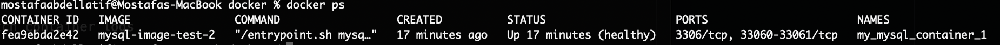
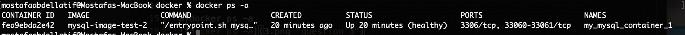
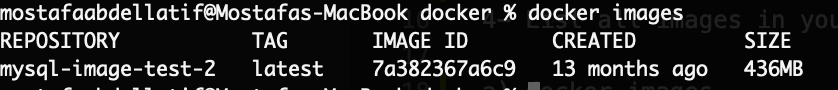
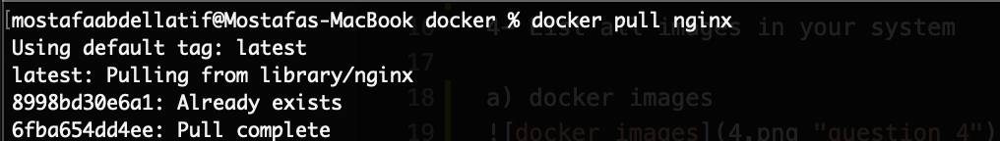
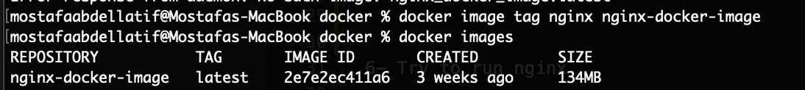

1- Install docker

a)docker -v 

2- List all running containers

a)docker ps

3- List all containers in your system

a)docker ps -a

4- List all images in your system

a) docker images

5- Pull nginx image and give it a name

a) 
- docker pull nginx

- docker image tag nginx nginx-docker-image

6- Try to run nginx.

    * Did it work? 

    * Why?

    * How to make it work?

7- Watch container logs

8- Try inspect container ip

9- Try to execute inside nginx continer

10- Try to remove nginx image. 

    * Did it work? 

    * Why?

    * How to solve it?

11- Try run ubuntu container.

    * Did it work?  

    * Why?

    * How to make it work?

12- Create a file inside ubuntu container

13- Exit the container.

14- Try to start it again. 

    * Did you find the file?

