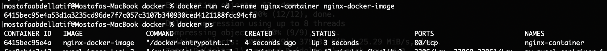
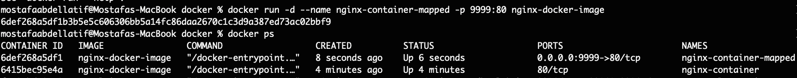
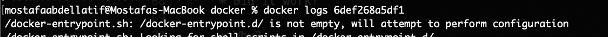
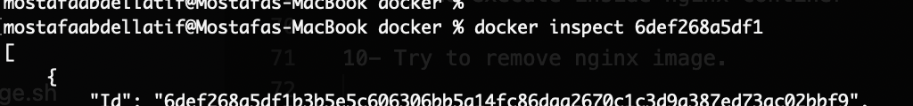
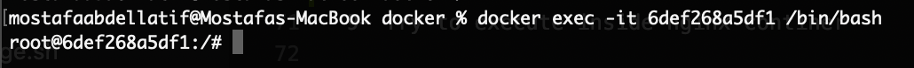
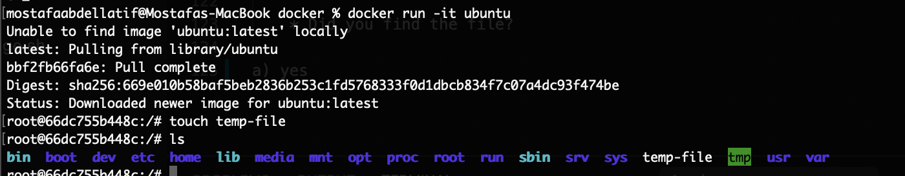
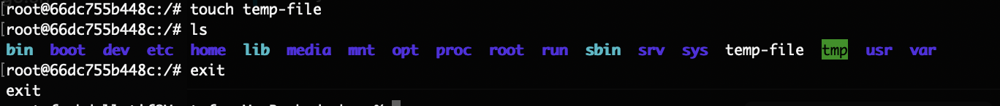
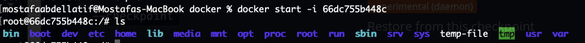

1- Install docker

a) docker -v 

2- List all running containers

a) docker ps

3- List all containers in your system

a) docker ps -a

4- List all images in your system

a) docker images

5- Pull nginx image and give it a name

a) 
- docker pull nginx

- docker image tag nginx nginx-docker-image

6- Try to run nginx.

    * Did it work? 

    a) Yes (docker run -d --name CONTAINER-NAME IMAGE-NAME)

    * Why?

    a) nginx will run, However it won't be accessible outside the container

    * How to make it work?

    a) By mapping it to a host port (in our case it will be the localhost)
    (docker run -d --name CONTAINER-NAME -p HOST-PORT:NGINX-PORT IMAGE-NAME)
    

7- Watch container logs

a) docker logs CONTAIER-ID

8- Try inspect container ip

a) docker inspect CONTAIER-ID

9- Try to execute inside nginx continer

a) docker exec -it CONTAIER-ID /bin/bash

10- Try to remove nginx image. 

    * Did it work? 

    a) No

    * Why?

    a) because the image is being used in a container

    * How to solve it?

    a) stop the container if it's running and then delete it, after that delete the image using (docker image rm IMAGE-ID)

11- Try run ubuntu container.

    * Did it work?  

    a) Yes, However it exited right after it

    * Why?

    a) because it can't be ran in detached mode

    * How to make it work?

    a) by ran it in an interactive mode using -it (docker run -it ubuntu)

12- Create a file inside ubuntu container

a) 
    - docker run -it ubuntu

    - touch temp-file

13- Exit the container.

a) exit

14- Try to start it again. 

    * Did you find the file?

a) Yes
    - docker start -i CONTAINER-ID
    - ls

